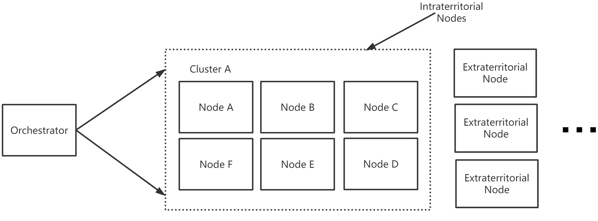
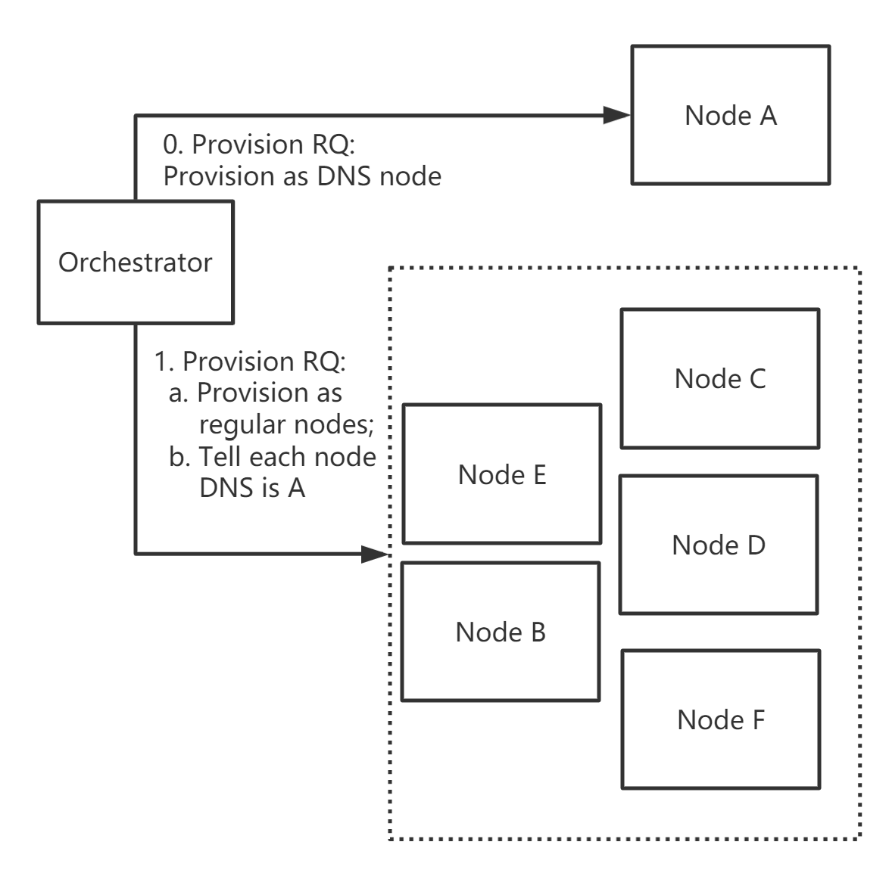
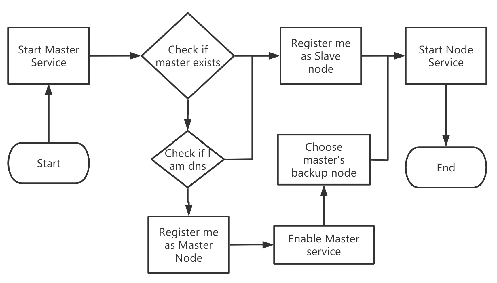

# Task-Org

A submodule of SATFAD, implemented for orchestrating docker-based tasks.

## Overview

## Working Phases
### 1. Provisioning Phase
The provisioning procedure aims to prepare the software environment for the smooth running of the system, which includes: 1. dependencies installation(dnsmasq, docker, getmac, firewalld, etc.); 2. service initializations (requiring sequential movements).

We would like to define the system into two layers: one for managing layer, which deals with target observation and its respective task generating, and the other one is operation layer, which is in charge of allocation of computational resources. The managing layer a logical layer that is not necessarily to be running on dedicated machines, whose `orchestrator` relays parameters for networking configurations to involved nodes to form a cluster. Nodes networked in the cluster are regarded as intraterritorial nodes, while nodes not networked are considered as extraterritorial nodes.

Whenever a cluster is constructed, an intraterritorial node will be firstly provisioned as a DNS request handler to ensure the functionality of name-based inter-machine communications. Other nodes will be afterwards informed to provision themselves as regular nodes. 

Information for node provisioning is quite simple. For the node in charge of handling DNS requests, a field indicating the type of provisioning will be sent to the chosen node. For other node, besides provisioning type, the IP address of provisioned DNS server is also included so that name-based accessing is ensured.

For nodes that are expected to be provisioned as DNS server, the only variations that characterize itself from others is the awareness of not being able to register itself to be the master role during the initialization period, and the exemption of the port 53. For regular nodes, the initialization process can be shown in the following figure.

### 2. Steady Working Phase
The steady working phase regards to the period after provisioning until the dead of the system, and the data flow during this phase is shown below.

***Node Service***
1. Always check if "I am the master"
2. Enable/Disable the master service of current node based on the result
given by `1`.
3. Node registering to the cluster

***Master Service***
1. Accepts tasks assigned to the cluster via the subordinate service `Webview Service`
2. Accepts backup info from current master node (when not activated)
3. Trigger the backup process (when activated)
4. Always syncing the status of members in the cluster from DNS service

***Slave Service***
1. Accepts tasks assigned by `master service`
2. Returns the execution status of tasks to master node
3. Monitors status of sensors, FPGA cores, GPU cores and CPU

***DNS service***
1. Provides storage for infos of members in the cluster
2. Handles Node registering
3. Responds to DNS requests

## Few Thoughts on the Design
### 1. Why using DNS mechanism for identifying roles and nodes?
One of the requirements to the framework is a mechanism for redundancy, where the running states of each docker containers should be able to be recovered if the host for running it is down. A heuristic intuition for the solution considers backing up information of container instances to the master of the cluster, so that container instances running on the dead machine can be revoked on other alive nodes by referencing the info backed-up in the master node. However, it is undoubtful that the possibility of master's dead should be taken into consideration, and although a mechanism for recovering master's info to a new node is made, other nodes are still not yet told to whom it should contact when it comes to a need for communicating with the "master". We are therefore curious about an implementation that allows a pronoun-fashioned node accessing, which is exactly what a dynamic DNS (dDNS) for. Under such a mechanism using dDNS, respective IP address targeting 'master.`DOMAIN_SUFFIX`' will updated whenever the master node is detected dead, and procedures for enabling back-up master node service are subsequently invoked. 

However, such a method also comes with shortages when one or more nodes simultaneouly belongs to more than one clusters. Therefore, a special DNS client specifically for network accessing of services in the framework is needed in order to differentiate accessing requests from different clusters, which will be completed in the near future. 

### 2. Why developed services-fashioned?
The system is expected to secure the data and functionalities when accidents such as sudden failure or dropout occur, as was discussed in aforementioned section, and architectural hemogeneity is therefore utilised. Instead of developing independent applications for each roles in the system, implementing each role in a fashion of service and deploy all these services to each node with a role-switching mechanism helps to reduce the possibility of errors during role switching, for it does not have to deal with data mid-way data transmision when role switching occurs. 

## Responsibilities of Each Module

## Assumptions and Problems
### Assumptions
1. Tasks are assigned by synchronized message -> no message redundancy
2. DNS server pre-set
3. Ports never occupied by other processes (23333, 23334, 23335)
### Problems
1. Switch Tree (caused by STP)
2. Licence
3. Assessment (What kind of criteria should be used)
